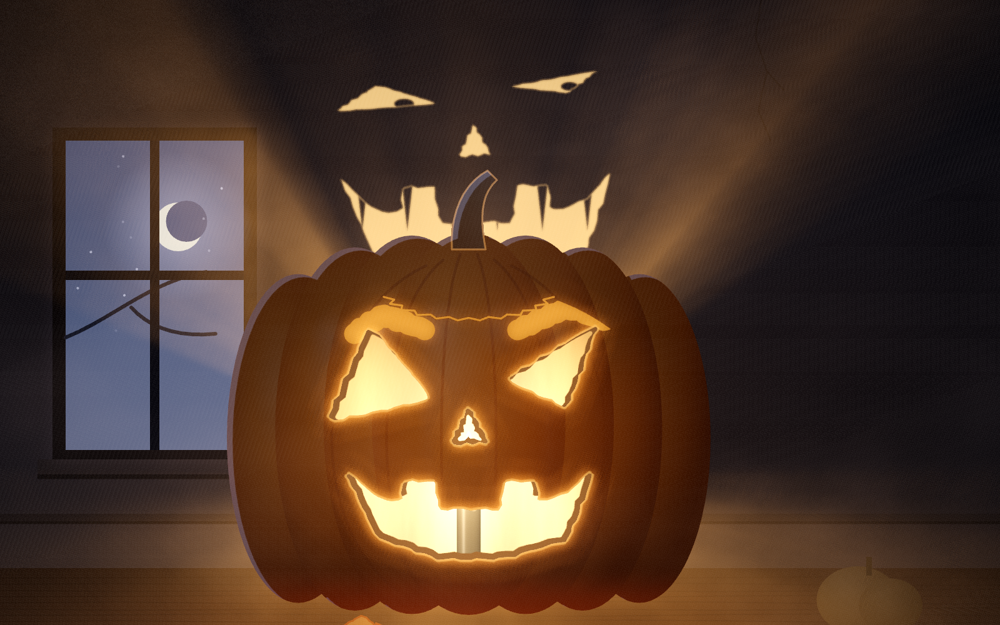
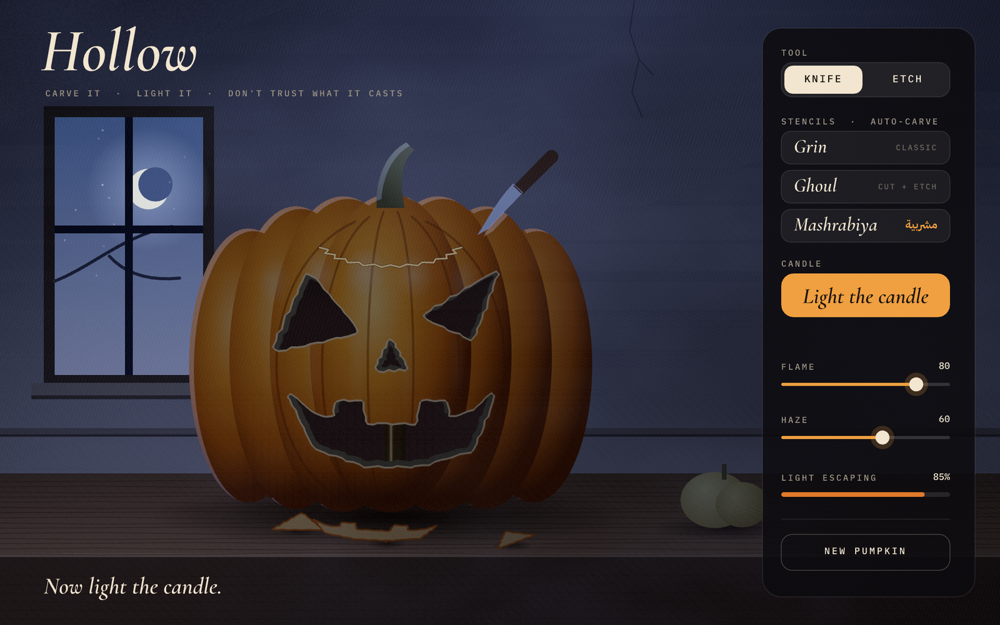
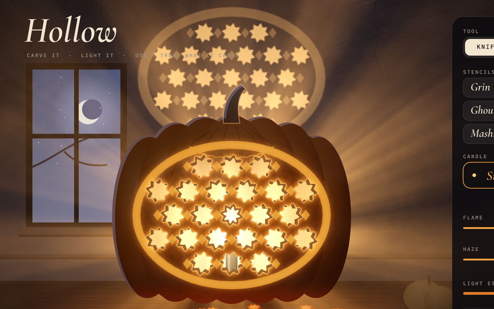
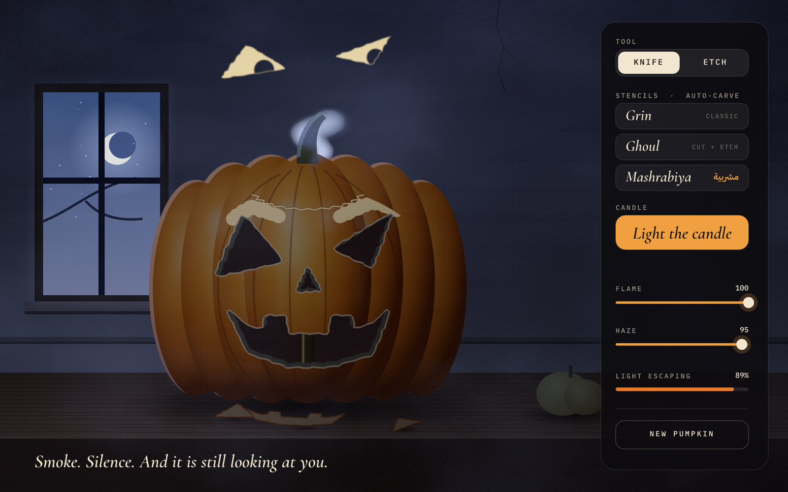
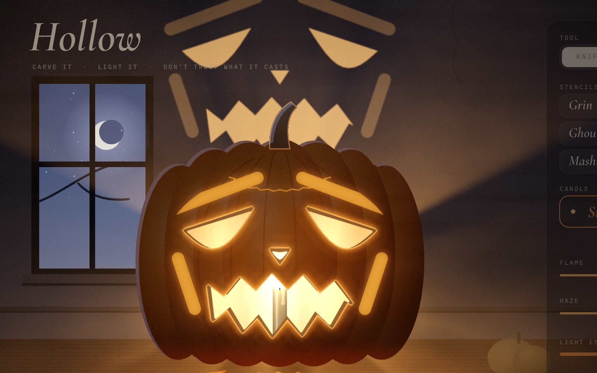

# Hollow

**Carve it. Light it. Don't trust what it casts.**

An interactive jack-o'-lantern built for the [Rive Halloween Challenge](https://contra.com/community/topic/rivehalloweenchallenge) (October 2026).

You carve a pumpkin with the pointer. A closed cut pops the piece out, and it tumbles onto the table. Etching shaves the skin so it glows softly instead of cutting through. Then you light the candle. A WGSL shader on a Rive GPU Canvas lights the room through whatever you carved: the cuts glow, the rind warms around them, rays stream through the haze, and your carving is thrown up onto the wall above the pumpkin, hard-edged, like a real projection. Leave it lit long enough and that face stops being the one you carved: its eyes narrow and blink, pupils follow your pointer, the grin widens and grows teeth, and the head tilts. Sweep a hand past the flame and it slides out of the light. Snuff the candle and smoke curls from the lid, but the eyes stay on the wall a moment longer than they should.



| | |
|---|---|
|  |  |
|  |  |

Video (60 s, 1600×1000, synthesised sound, no voice): [media/hollow.mp4](media/hollow.mp4) · page: https://taktek.io/hollow/ (https://taktekhq.github.io/hollow/ redirects there)

## What it does

- **Knife**: drag on the pumpkin to cut. If you close the shape, the piece falls out and lands on the table. If you leave it open, you get a slit that lets a thin line of light through.
- **Etch**: shaves the skin. The thin flesh glows amber when the candle is lit.
- **Stencils**: *Grin*, *Ghoul* (cut and etch) and *Mashrabiya* (مشربية, the carved wooden screens of old Beirut houses). The script traces each outline with the knife, and the eight-point stars cast across the room.
- **Candle**: lighting it overshoots like a struck match and then settles into a flicker. A fast sweep of the pointer past the pumpkin is a gust: the flame dips and the room darkens. Snuffing it sends a curl of smoke out of the lid.
- **Flame / Haze** sliders and a **Light escaping** readout that tracks how much of the face is open.
- **The face on the wall**: the candle throws your carving onto the wall. After six seconds of candlelight with at least two holes cut, it comes alive: the script finds its eyes and mouth among your cuts, narrows and blinks the eyes, gives them pupils that follow the pointer, widens the grin and adds fangs, and tilts the head. A gust slides it out of the light; it creeps back. A pattern with no eyes (the mashrabiya) grows a pair.
- **The panel steps back**: while the candle burns and the pointer is out in the room, the panel and title fade out (a `chrome` view-model number bound to their opacity); they come back as soon as the pointer heads for them.

## How it's built

It's all plain text. A coding agent wrote it, and the [Rive CLI](https://rive.app/docs/cli/overview) built and tested it headless. There was no editor pass yet (see "Rive Editor touch-ups" below).

| File | Role |
|---|---|
| `scene.rml` | The artboard: title, caption, the control panel, the view model, three state-machine layers (title intro, tool pill, candle button) and the click listeners. Generated by `tools/gen_scene.py` so the buttons, listeners and states stay in step. |
| `main.luau` | A `ScriptedLayout` that owns the room. It handles pointer input, the carving, stencil jobs, falling pieces, the candle, the gust and the ghost. Every frame it draws five canvases: albedo, carve mask (R cut, G etch, B rind), a quarter-size mask, the wall (R your carving thrown up, B the face once alive, G its pupils and teeth), and emission. Then it runs the shader on a GPU canvas and draws the result under the markup. |
| `light.wgsl` | The lighting pass: moonlight from the window, glow through the cuts, sub-surface warmth in the rind, the visible flame and candle through the holes, a 36-tap ray march toward the flame, the wall face with a small penumbra, fog, vignette, grain, filmic curve. |

Rive features used:

- **Rive CLI**: build, verify, headless screenshots, and the pointer replays that render every video frame.
- **GPU Canvas (WGSL)**: one fullscreen pass with 5 textures and a 96-byte uniform block.
- **Luau scripting**: `ScriptedLayout` with pointer handlers, offscreen `Canvas`es, `GPUPipeline`/`GPUBindGroup`.
- **Data binding**: the view model `Hollow`, with `tool`, `lit`, `stencil`, `fresh`, `flame`, `haze`, `escape` and the text readouts. Range-mapper converters drive the slider knobs and bars, and a boolean-negate converter drives the candle toggle. Markup writes what the script reads, and the script writes what the markup shows.
- **State machines**: a tool layer (the pill slides with a cubic overshoot of `0.3, 1.45, 0.55, 1`), a candle layer (fill, stroke and label crossfade) and an intro layer (the title rises with an eased fade). A scripted hover halo glides between the panel controls on a spring tuned against rendered frames, through data binding.

A gotcha worth knowing: paths drawn from a script fill with the **clockwise** rule, so a counter-clockwise contour draws nothing. `cw()` in `main.luau` normalises every polygon, including whatever the user draws. `Paint.feather` also misbehaved in offscreen canvases here, so every glow and shadow is a radial gradient instead (`soft()`).

## Build and run

```bash
curl -fsSL https://releases.rive.app/cli/install.sh | bash   # Rive CLI 1.5+
export PATH="$HOME/.rive/bin:$PATH"

python3 tools/gen_scene.py          # regenerate scene.rml (only after editing the generator)
rive . --verify                     # RML + Luau types + WGSL
rive .                              # live preview window, rebuilds on save
rive . --screenshot=shots/x.png --pointer=down@405,392 --pointer=move@460,360 --pointer=up@405,392 --advance=30
```

The 1600×1000 stills use `--viewport=1600x1000 --fit=contain --data=quality=1.25`. The `quality` view-model number renders the canvases at 1.25× so the upscale stays sharp.

To publish an embeddable page, run `rive . --publish=web`. This needs `rive login`, because scripts have to be signed before web runtimes run them. Local builds and screenshots need no account.

### The video

`tools/timeline.py` scripts a person's pointer as timed `down/move/up` events. `tools/render_take.py` renders every frame as its own headless `rive --screenshot` run that replays the events up to that moment, in parallel workers with one project copy each. `tools/make_video.py` (Pillow + numpy) adds the title, the source/CLI segment, the pointer, the feature callouts and the credits, and synthesises the soundtrack from the same input events (knife scrapes while the pointer is down on the pumpkin, the pop and the thud of each piece, the match, the flame, the gust, the swell when the wall looks back, the snuff, a music-box theme and room tone). `tools/make_stills.py` pulls the stills and the cover from the same frames.

One command rebuilds all of it (about an hour on a busy machine):

```bash
tools/render_all.sh            # verify, render both takes at 1600x1000, cut media/hollow.mp4, write the stills + media/hero.jpg
KEEP=1 tools/render_all.sh     # reuse rendered frames (after editing only the cut or the sound)
```

On a machine with a second GPU whose driver is flaky, headless EGL can fail with `eglInitialize failed (no display server)`. The scripts set `EGL_PLATFORM=surfaceless`, which goes straight to the working GPU.

The page (`site/index.html`, plus `media/` and `fonts/`) is published to GitHub Pages by `.github/workflows/pages.yml` on every push to `main`.

## Rive Editor touch-ups (planned)

The challenge rewards a human pass in the Rive Editor. Once a Rive account is logged in, the plan is to import the `.rev` (`rive . --once --rev=build/hollow.rev`) and then:

- hand-key a hover/press state for every panel button
- redraw the knife cursor as vector art
- retime the candle crossfade and the tool pill ease by feel
- add a small intro animation for the title

## Credits

- Concept, code and shaders: Taktek, written with an AI coding agent through the Rive CLI.
- Fonts (SIL Open Font License 1.1, licences in `fonts/`):
  - [Cormorant Garamond](https://github.com/CatharsisFonts/Cormorant) by Christian Thalmann (Catharsis Fonts). The static SemiBold Italic and Medium instances were cut from the variable font with fontTools.
  - [IBM Plex Mono](https://github.com/IBM/plex) and [IBM Plex Sans Arabic](https://github.com/IBM/plex) by IBM.

Code: MIT (see `LICENSE`). Fonts: OFL.
